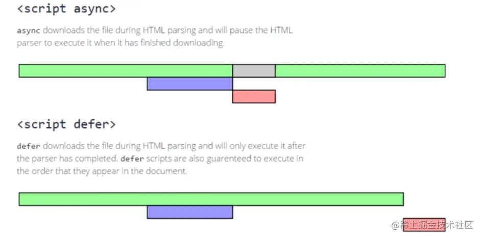

### 1.口诀

​	【js全堵塞，css半堵塞】：js全堵塞是指js加载的时候，css、html的加载和解析都会被堵塞掉，这是只能够加载和解析js；css半堵塞是指css加载的时候，会把js的加载和页面的渲染给堵塞掉，但是不会影响html的加载和解析，之所以会堵塞渲染，是为了页面渲染上去后，又解析到css样式，防止重新进行渲染。

### 2.script标签的defer和async属性

​	**defer**：中文翻译是延迟的意思，即script标签进行异步下载，下载完之后等文档解析完之后进行加载，在DOMContentLoaded事情触发之前执行，因为script标签也算是DOMContent的一部分。

​	**async**：中文翻译是异步的意思，即script标签进行异步下载，但是不同于defer，async的script标签下载完之后就立即执行，阻塞html、css的加载和解析。

​	**不带有defer、async的script标签**：遇到script标签就立即下载并执行js脚本，在这期间阻塞html、css的加载和解析。

​	**async和defer的区别如下图**：

​	注*：绿色代表文档解析，紫色代表网络下载js，灰色代表文档解析被阻塞，红色代表js脚本执行

### 3.link标签的prefetch和preload

​	**prefetch**：浏览器利用空余时间去下载资源。

​	**preload**：优先下载和加载该资源。