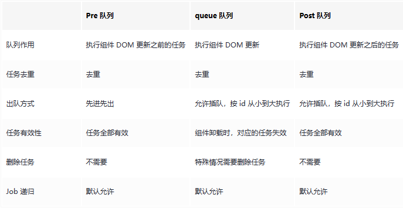

### 1.认识scheduler

​	scheduler的翻译为【任务调度器】，直白点来说，就是我们把需要执行的任务和附带一些信息交给scheduler，让scheduler根据这些信息去决定何时去执行这些任务。

### 2.认识queue



​	关于`preQueue`、`queue`、`postQueue`的命名：主要是以执行DOM更新任务时机作为参考系进行命名的。

​	任务去重：三种队列都存在该功能，主要是优化性能，避免重复执行。

​	queue队列的删除任务场景：组件的DOM更新是深度更新来的，当父组件的update完之后，需要递归执行子组件的更新任务，这个时候需要把队列中的存在的子组件更新任务给删掉，避免重复执行。

​	queue队列任务失效的场景：当组件被卸载时，就会把对应组件的`dom`更新任务给失效掉。

​	删除任务和任务失效的区别：删除任务之后，后续可以重新将任务加入队列。任务失效之后，对应的任务后续就不可加入任务队列中来，会被拦截掉。

​	关于queue队列优先于pre队列的场景：在组件外调用watch，那么watch产生的pre job的执行就会比dom更新慢，因为在组件外调用watch产生的job没有id，对应没有id的job，会默认赋值为无穷大。

### 3.关键源码解读

​	要点须知：`Vue3`的最新提交中，把`preQueue`和`queue`都统一使用`queue`来进行记录了；`preQueue`和`queue`队列的任务(job)的区别，`preQueue`队列的job的`pre`属性为`true`。

#### 3.1 `queueJob`

​	接入`queue`队列，任务有两种，分别是`preQueue`和`queue`。

```typescript
// 加入queue队列
// queue队列主要包含两种任务：
//  第一种: pre属性为true，代表是dom更新前执行的job
//  第二种: pre属性为false，带有id字段，是dom更新相关的任务
export function queueJob(job: SchedulerJob) {
  // the dedupe search uses the startIndex argument of Array.includes()
  // by default the search index includes the current job that is being run
  // so it cannot recursively trigger itself again.
  // if the job is a watch() callback, the search will start with a +1 index to
  // allow it recursively trigger itself - it is the user's responsibility to
  // ensure it doesn't end up in an infinite loop.
  if (
    // queue没有length，则不需要查重，直接丢进去
    !queue.length ||
    !queue.includes(
      job,
       // 如果正在执行job并且允许递归的话，则检测job的index + 1,不包括当前项
      isFlushing && job.allowRecurse ? flushIndex + 1 : flushIndex
    )
  ) {
    if (job.id == null) {
        // 没有id的job放到最后
      queue.push(job)
    } else {
        // 有id的job从小打到排序，放到对应位置
      queue.splice(findInsertionIndex(job.id), 0, job)
    }
    // 执行job
    queueFlush()
  }
}
```

#### 3.2 准备开启执行任务

```typescript
function queueFlush() {
    // 没有正在执行job，也没有刚把job加进异步队列中
  if (!isFlushing && !isFlushPending) {
    isFlushPending = true
    // resolvedPromise其实就是Promise.resolve()
    // 将flushJobs放进微任务队列中执行
    currentFlushPromise = resolvedPromise.then(flushJobs)
  }
}
```

#### 3.3 执行任务

关注重点：

	1. job排序: id越小越优先，然后是`pre`为true优先
	2. 执行顺序
	3. 循环执行：当执行完一轮的`flushJobs`之后，看看是否有新的任务加入，有就递归执行。

```typescript
function flushJobs(seen?: CountMap) {
  // 执行就代表resolve了，取消pending状态
  isFlushPending = false
  // 正在执行job
  isFlushing = true
  if (__DEV__) {
    seen = seen || new Map()
  }

  // Sort queue before flush.
  // This ensures that:
  // 1. Components are updated from parent to child. (because parent is always
  //    created before the child so its render effect will have smaller
  //    priority number)
  // 2. If a component is unmounted during a parent component's update,
  //    its update can be skipped.
  // 排序，id小的优先执行，其余的先来后到
  queue.sort(comparator)

  // conditional usage of checkRecursiveUpdate must be determined out of
  // try ... catch block since Rollup by default de-optimizes treeshaking
  // inside try-catch. This can leave all warning code unshaked. Although
  // they would get eventually shaken by a minifier like terser, some minifiers
  // would fail to do that (e.g. https://github.com/evanw/esbuild/issues/1610)
  const check = __DEV__
    ? (job: SchedulerJob) => checkRecursiveUpdates(seen!, job)
    : NOOP

  try {
    for (flushIndex = 0; flushIndex < queue.length; flushIndex++) {
      const job = queue[flushIndex]
      // active为false，说明组件被卸载，相关的job就无需执行了
      if (job && job.active !== false) {
        // 校验递归次数有没有超过最大值
        if (__DEV__ && check(job)) {
          continue
        }
        // console.log(`running:`, job.id)
        callWithErrorHandling(job, null, ErrorCodes.SCHEDULER) // 执行job
      }
    }
  } finally {
    // 执行完queue里的job，相关标志位重新初始化
    flushIndex = 0
    queue.length = 0

    // 执行post类型的job，即：dom更新完之后执行的job
    flushPostFlushCbs(seen)

    isFlushing = false
    currentFlushPromise = null
    // some postFlushCb queued jobs!
    // keep flushing until it drains.
    // 执行完，如果又有新加入的，则继续循环执行job
    if (queue.length || pendingPostFlushCbs.length) {
      flushJobs(seen)
    }
  }
}
```

